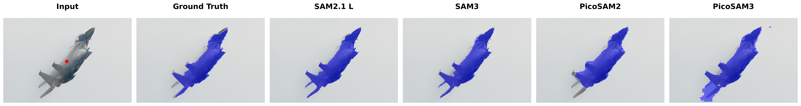
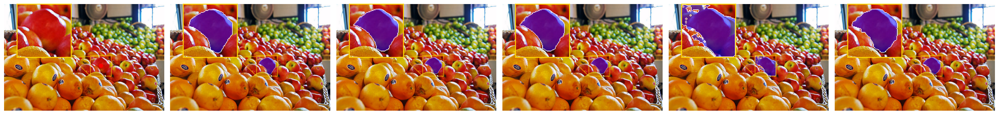
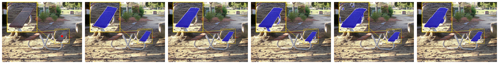
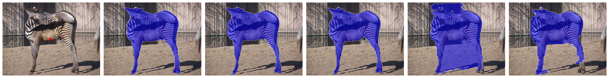

# PicoSAM3: Real-Time In-Sensor Region-of-Interest Segmentation

### [📜 PicoSAM2](https://arxiv.org/pdf/2506.18807)  | 📜 [PicoSAM3](https://arxiv.org/pdf/2603.11917)

---
## Qualitative Results






**PicoSAM2** and **PicoSAM3** are minimal, segmentation model distilled from Meta’s SAM 2.1 and SAM3 — purpose-built for deployment on edge devices such as the **Sony IMX500**. It replicates the implicit centered image segmentation while drastically reducing model size and computational cost, making real-time inference feasible on low-power hardware.

>  ~1.2MB quantized model  
>  Real-time inference on embedded devices  
>  Supports implicit point-based prompt segmentation  
>  Distilled from SAM2.1  Hiera Tiny and SAM3

---
## References & Citation ✉️ 

This repository reproduces the results from our article, which received the Outstanding Lecture Award at IEEE Sensors 2025 in Vancouver.
If you find this work useful please cite us with the following:
``` 
@article{picosam3_2026,
      title={PicoSAM3: Real-Time In-Sensor Region-of-Interest Segmentation}, 
      author={Pietro Bonazzi and Nicola Farronato and Stefan Zihlmann and Haotong Qin and Michele Magno},
      journal={IEEE Sensors Journal},
      year={2026}
}

@article{picosam2_2025,
      title={PicoSAM2: Low-Latency Segmentation In-Sensor for Edge Vision Applications}, 
      author={Bonazzi, Pietro and Farronato, Nicola and Zihlmann, Stefan and Qin, Haotong and Magno, Michele},
      journal={IEEE Sensors Conference}, 
      year={2025}
}
```

Leave a star to support our open source initiative!⭐️ 

## Quick Start

PicoSAM2 and PicoSAM3 come with an automated setup script `init.sh` to get everything ready in one step. It:

- Downloads **COCO 2017** validation and training images  
- Downloads **LVIS v1** validation annotations  
- Unzips and organizes all files under a structured `dataset/` folder  
- Downloads all **SAM 2.1** model checkpoints into `checkpoints/`   
- Installs all required dependencies from `requirements.txt`  
- Installs the project into the environment  


### To get started, simply run:

```bash
./init.sh
```
You do **not** need to manually download any datasets or checkpoints — everything is handled by the script.

Afterwards (optional if you just want to use the compression pipeline) download the pretrained PicoSAM2 weights from this [Zenodo folder](https://zenodo.org/records/15728470) and the PicoSAM3 weights from [HuggingFace](https://huggingface.co/pietrobonazzi/picosam3) and add them to the checkpoints directory.

## How to Use

Once the setup is complete, activate the environment:

```bash
source .venv/bin/activate
```

Then you can run any script inside the `model_compression/` folder:

```bash 
python3 -m model_compression.scripts.picosam3_model_distillation       # Distill student from SAM3
python3 -m model_compression.scripts.picosam3_train_from_scratch       # Train supervised baseline
python3 -m model_compression.scripts.benchmark                         # Evaluate mIoU, mAP 
python3 -m model_compression.scripts.imx500_converter                  # Export ONNX for IMX500
```

## Live Demo on Raspberry Pi 5 + IMX500

A ready-to-run interactive segmentation demo is included. Inference runs entirely **on the IMX500 sensor** — no CPU compute needed.

### Prerequisites

- Raspberry Pi 5 with Sony IMX500 AI camera
- `picamera2` with IMX500 support installed (comes with Raspberry Pi OS)
- `uv` installed (`curl -LsSf https://astral.sh/uv/install.sh | sh`)
- The compiled `checkpoints/rpk/network.rpk` (download from [HuggingFace](https://huggingface.co/pietrobonazzi/picosam3))

### Run

```bash
./run_demo.sh
```

> `picamera2` and `cv2` are system packages on Raspberry Pi OS — the script uses the system Python directly.

### Controls

| Action | Effect |
|---|---|
| Left-click + drag | Draw a bounding box — the model segments the object inside |
| `r` | Reset to full frame |
| `q` / ESC | Quit |

### How it works

The IMX500 crops the sensor image to the drawn ROI, resizes it to 96×96, and runs PicoSAM3 entirely on-chip. The output mask is read back over the MIPI link and overlaid on the live 1280×960 feed via picamera2.

### CPU-only demo (no camera needed)

```bash
python3 demo_picosam3.py
# Saves result to demo/data/demo_result.png
```

---

## Deployment on the IMX500

Follow the official Raspberry Pi AI Camera documentation: https://www.raspberrypi.com/documentation/accessories/ai-camera.html#model-deployment

**Step 1 — Quantize** (run on any machine with Python 3.11 + Sony MCT):
```bash
conda activate sony_env
python3 model_compression/scripts/imx500_converter.py
```

**Step 2 — Convert to IMX500 format** (requires `imxconv-pt`, run on x86 Linux):
```bash
imxconv-pt -i checkpoints/PicoSAM3_student_quantized.onnx -o checkpoints/imx_out --overwrite-output
```

**Step 3 — Package** (run on Raspberry Pi):
```bash
imx500-package checkpoints/imx_out/packerOut.zip checkpoints/rpk/
```

This produces `checkpoints/rpk/network.rpk`, which `demo_imx500.py` loads automatically.

## Pretrained Checkpoints

After setup, the following files are available under `checkpoints/`:

**PicoSAM3** — available on [HuggingFace](https://huggingface.co/pietrobonazzi/picosam3):

| File                              | Description                                      |
|-----------------------------------|--------------------------------------------------|
| `PicoSAM3_student_epoch1.pt`      | Student model trained via distillation           |
| `PicoSAM3_epoch1.pt`              | Supervised baseline                              |

**PicoSAM2** — available on [Zenodo](https://zenodo.org/records/15728470):

| File                              | Description                                      |
|-----------------------------------|--------------------------------------------------|
| `PicoSAM2_student_epoch1.pt`      | Student model trained via distillation           |
| `PicoSAM2_student_quantized.onnx` | Quantized export ready for IMX500 conversion     |
| `PicoSAM2_epoch1.pt`              | Supervised baseline                              |

**SAM 2.1 teacher models** (downloaded automatically by `init.sh`):

| File                    | Description                    |
|-------------------------|--------------------------------|
| `sam2.1_hiera_*.pt`     | SAM 2.1 teacher models (Tiny → Large) |

These are ready for use in training, benchmarking, or deployment.

## Directory Structure

```
.
├── checkpoints/                     # Pretrained models & teacher weights
│   ├── PicoSAM2_epoch1.pt
│   ├── PicoSAM2_student_epoch1.pt
│   ├── PicoSAM2_student_quantized.onnx
│   ├── sam2.1_hiera_tiny.pt
│   ├── sam2.1_hiera_small.pt
│   ├── sam2.1_hiera_base_plus.pt
│   ├── sam2.1_hiera_large.pt
│   └── download_ckpts.sh
│
├── dataset/                         # COCO + LVIS data
│   ├── train2017/
│   ├── val2017/
│   ├── val2017_lvis/
│   └── annotations/
│       └── lvis_v1_val.json
│
├── model_compression/               # All model code
│   ├── benchmark.py
│   ├── imx500_converter.py
│   ├── picosam2_model_distillation.py
│   ├── picosam2_train_from_scratch.py
│   ├── plot_latency_vs_size.py
│   ├── plot_map_vs_size.py
│   ├── plot_miou_vs_size.py
│   ├── plot_size_comparison.py
│   └── requirements.txt
│
├── init.sh                          # Setup script (data, env, install)
```
